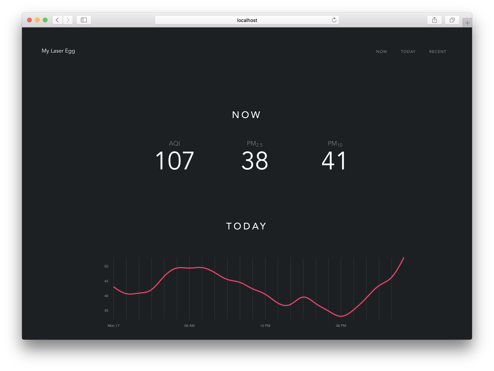

# my-laser-egg (WIP)

<p align="center">
  
</p>

> Web Dashboard for [Origins Laser Egg](http://originstech.com/products/laser-egg/) 镭豆智能空气质量检测仪

## Get the right ID

Each Laser Egg has a unique UDID. But the API uses another ID called *Laser Egg ID*. You will call manufacturer’s API to get the `laser_egg_id`.

1. Go to Kaiterra app and click *details* icon, a \> in a circle.
2. Click *configure* icon, a gear in a circle.
3. In the *Device Information* section, you will find a blue *copy*. Click on this to copy the UDID string.
4. configure your Laser Egg's UDID:

```bash
cd src
cp config.sample.js config.js
```

repalce `YOUR Laser Egg timeId` with your Laser Egg's UDID.

## Build Setup

``` bash
# install dependencies
npm install

# serve with hot reload at localhost:8080
npm run dev

# build for production with minification
npm run build
```
